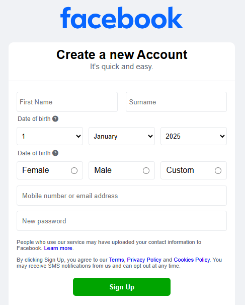

# Facebook Signup Clone

A pixel-perfect recreation of Facebook's signup page built with vanilla HTML, CSS, and JavaScript using Vite as the build tool.

## Screenshot



## 🚀 Features

- **Responsive Design**: Optimized for various screen sizes
- **Interactive Form Elements**: Dynamic date selectors and form validation
- **Authentic Styling**: Matches Facebook's original signup page design
- **Modern Development**: Built with Vite for fast development and hot reloading
- **Accessibility**: Proper form labels and semantic HTML structure

## 🛠️ Technologies Used

- **HTML5**: Semantic markup structure
- **CSS3**: Custom styling with SF Pro Display font
- **JavaScript (ES6+)**: Form interactions and dynamic content
- **Vite**: Build tool and development server
- **Font Awesome**: Icons for enhanced UI
- **Google Fonts**: SF Pro Display font family

## 📁 Project Structure

```
facebook-signup-clone/
├── public/
│   └── facebook-icon.ico
├── src/
│   ├── assets/
│   │   └── logo.svg
│   ├── style.css
│   └── main.js
├── index.html
├── package.json
└── README.md
```

## 🚀 Getting Started

### Prerequisites

- Node.js (version 14 or higher)
- npm or yarn

### Installation

1. Clone the repository:

```bash
git clone [<your-repo-url>](https://github.com/TshegofatsoMkhabela/facebook-ui-login.git)
cd facebook-ui-login
```

2. Install dependencies:

```bash
npm install
```

3. Start the development server:

```bash
npm run dev
```

4. Open your browser and navigate to `http://localhost:5173`

## 🔗 Live Demo

[facebook-ui-login.vercel.app](https://facebook-ui-login.vercel.app)

---

**Note**: This is a frontend-only implementation. No actual account creation or data processing occurs.
